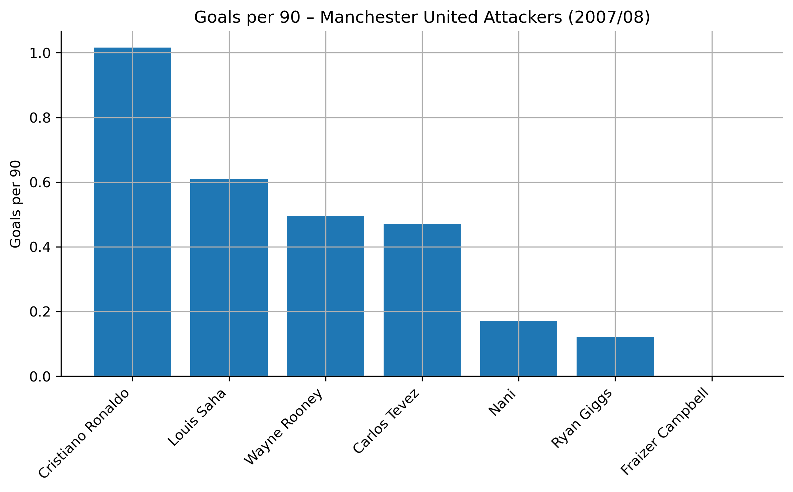
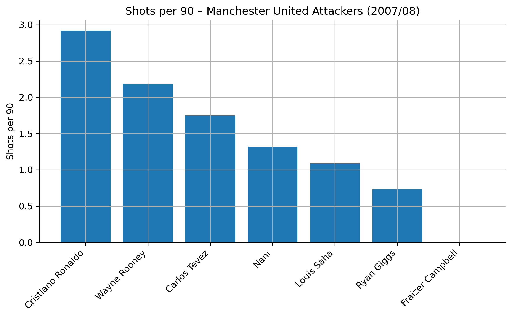
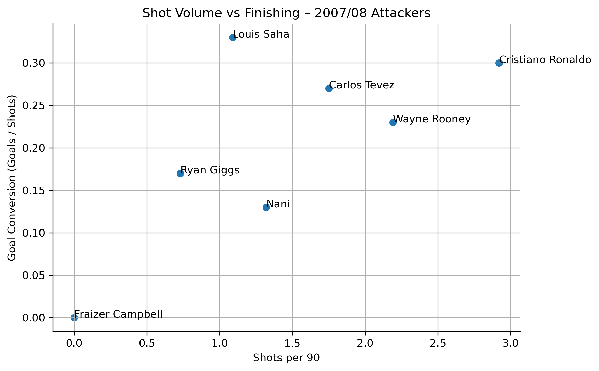
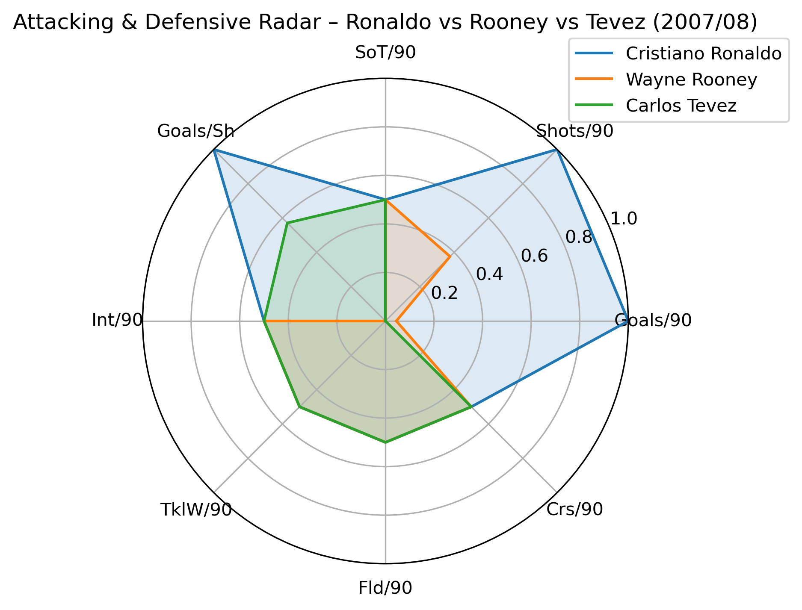
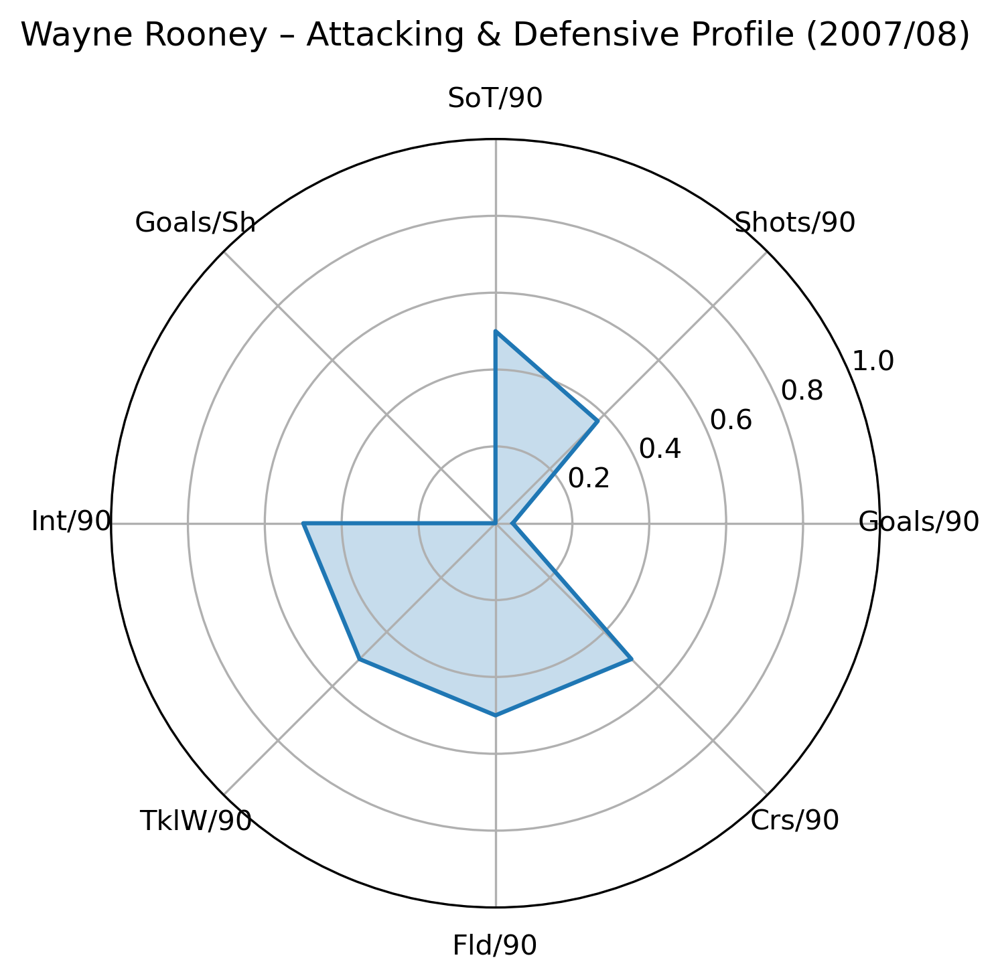

# Manchester United 2007/08 – Attacking Unit Analysis

This project analyzes the attacking profiles of Manchester United’s forwards during the 2007/08 Premier League season.  
The goal is to quantify roles, shot volume, finishing efficiency, and off-ball contribution using FBref-derived data.

## Dataset

All datasets were manually exported from FBref and include:

- `manutd_2007_08_playing_time.csv`
- `manutd_2007_08_shooting.csv`
- `manutd_2007_08_misc.csv`
- `manutd_2007_08_matches_raw.csv`

Only real, available stats were used; unavailable metrics (e.g., detailed passing, xA, progressive passes) were intentionally excluded.

## Focused Player Group (Attackers)

- Cristiano Ronaldo  
- Wayne Rooney  
- Carlos Tevez  
- Ryan Giggs  
- Nani  

Primary analysis centers on Ronaldo, Rooney, and Tevez.

---

## 1. Data Cleaning & Preparation

We:

- Loaded raw FBref tables from `data/raw/`
- Cleaned column names, formats, and units
- Filtered players by attacking positions (FW, WF, AM)
- Merged playing time, shooting, and misc tables
- Constructed per-90 metrics for all relevant actions:
  - Goals per 90  
  - Shots per 90  
  - Shots on target per 90  
  - Goal conversion  
  - Defensive actions per 90 (tackles won, interceptions, fouls drawn)

The merged per-attacker DataFrame is the foundation for all visuals in `02_attack_profile.ipynb`.

---

## 2. Shot Volume Analysis

### Shots per 90

A bar chart of shots per 90 highlights:

- Ronaldo leading the team at roughly 3 shots per 90  
- Rooney and Tevez forming a second tier (~1.8–2.2 shots per 90)  
- Nani and Giggs contributing situationally rather than as primary shooters  

This reflects Ferguson’s attacking structure:  
Ronaldo acted as the primary finisher, with Rooney and Tevez as hybrid creator-scorers.

---

## 3. Shot Volume vs Finishing Efficiency

A scatterplot compares:

- Shots per 90 (shot volume)  
- Goal conversion (goals per shot)

Findings:

- Ronaldo combines elite volume with strong finishing  
- Tevez shows efficient finishing at moderate volume  
- Rooney is heavily involved in chance creation and shooting, with slightly lower conversion  
- Saha (limited minutes) appears as an extremely efficient finisher

This visualization clearly separates role and efficiency among the forwards.

---

## 4. Multi-Player Radar: Ronaldo vs Rooney vs Tevez

A normalized radar chart compares the three main forwards across:

- Goals per 90  
- Shots per 90  
- Shots on target per 90  
- Goal conversion (goals per shot)  
- Defensive actions per 90 (tackles won and interceptions)  
- Fouls drawn per 90  
- Crosses per 90  

Interpretation:

- **Cristiano Ronaldo** dominates almost every attacking axis with solid defensive contribution.  
- **Wayne Rooney** shows a broad two-way profile: pressing, defensive work, and link-up play in addition to shooting.  
- **Carlos Tevez** balances finishing quality with high work rate and off-ball aggression.

The radar shows how their profiles complemented each other within the same front line.

---

## 5. Visualizations

Below are the main visuals included in this analysis.

### Goals per 90



This bar chart compares each forward’s goals per 90 minutes, highlighting Ronaldo’s elite output and the secondary contribution from Saha, Rooney, and Tevez.

### Shots per 90



Here we compare shot volume per 90. Ronaldo leads the unit, with Rooney and Tevez also taking on significant shooting responsibility, while Giggs and Campbell have much lower volume.

### Shot Volume vs Finishing



This scatter plot maps **shots per 90** against **goal conversion (goals / shots)**.  
It shows which forwards pair high volume with strong efficiency (Ronaldo, Saha, Tevez), and which profiles tilt more toward volume than finishing.

### Radar Profiles

#### Overlay – Ronaldo vs Rooney vs Tevez



This overlay radar compares the three main forwards across attacking and defensive metrics, showing Ronaldo’s all-round dominance, Rooney’s work rate and link play, and Tevez’s balanced profile.

#### Individual Forward Profiles





Each individual radar highlights how their roles differ within the same attacking unit, combining shooting, chance creation, and defensive work.


## 6. Individual Player Radars

Separate radars are created for:

- Cristiano Ronaldo  
- Wayne Rooney  
- Carlos Tevez  

Each radar highlights player-specific attributes, including attacking output, defensive involvement, and their tendency to draw fouls or contribute to defensive phases from the front.  
These individual views are useful for communicating role and playing style to non-technical audiences.

---

## 6. Summary of Findings

Manchester United’s 2007/08 forward line functioned at a high level due to clear role specialization:

**Cristiano Ronaldo**  
- Primary shooter and finisher  
- High-usage offensive focal point  
- Dominant shot generator and scorer

**Wayne Rooney**  
- Hybrid forward (creator, presser, link-up player)  
- High defensive contribution among forwards  
- Bridges midfield and attack, especially in pressing and build-up play

**Carlos Tevez**  
- Efficient finisher  
- Relentless presser  
- Connects play with constant movement and defensive work rate

Giggs and Nani provided width, crossing, and rotational depth from wide attacking roles.

Overall, the attack blended high shot volume from Ronaldo with the complementary strengths of Rooney and Tevez, producing a balanced and effective unit.

---

## Repository Structure

```text
manutd-2007-08-style-profile/
│
├── data/
│   └── raw/
│       ├── manutd_2007_08_matches_raw.csv
│       ├── manutd_2007_08_misc.csv
│       ├── manutd_2007_08_playing_time.csv
│       └── manutd_2007_08_shooting.csv
│
├── notebooks/
│   └── 02_attack_profile.ipynb
│
├── plots/
│   ├── shots_per90.png
│   ├── volume_vs_conversion.png
│   ├── radar_three_forwards.png
│   ├── radar_ronaldo.png
│   ├── radar_rooney.png
│   └── radar_tevez.png
│
├── reports/
│   └── (placeholder for future write-ups / PDFs)
│
├── LICENSE
└── README.md
How to Run

Install dependencies:

pip install pandas numpy matplotlib

Launch the notebook:

jupyter notebook notebooks/02_attack_profile.ipynb


Execute all cells to reproduce:

Data cleaning and merging

Metric computation

Visualizations (bar charts, scatterplot, radars)

Next Steps (Future Work)

Potential extensions:

Build a midfield unit profile (passing, ball progression, defensive coverage)

Build defensive unit and goalkeeper profiles

Add match-level xG and shot maps when appropriate data is available

Wrap the analysis in a simple Streamlit or Dash app for interactive exploration

## Data Source

**FBref / StatsBomb**  

All match-level and player-level statistics (minutes played, goals, assists, shots, xG, key passes, progressive passes, defensive actions, etc.) were collected from FBref’s public StatsBomb dataset.  
  https://fbref.com/en/

*Data used only for educational, non-commercial analysis.*


## License

This project is released under the MIT License.

Contact

Arnav Jain Master of Science in Data Science, University of Virginia LinkedIn: https://www.linkedin.com/in/arnavjain2026/

For collaboration or football-analytics opportunities, feel free to reach out.


